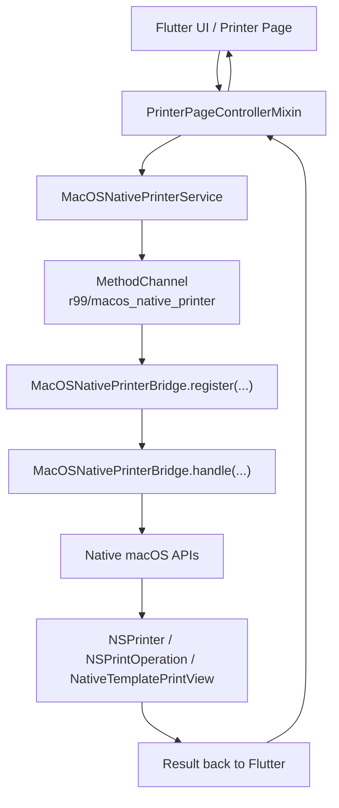
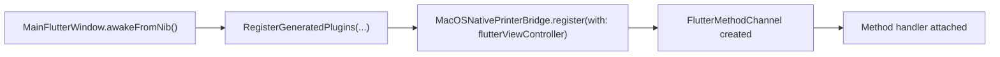
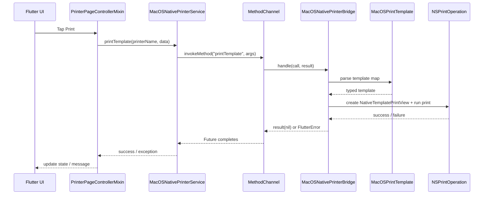
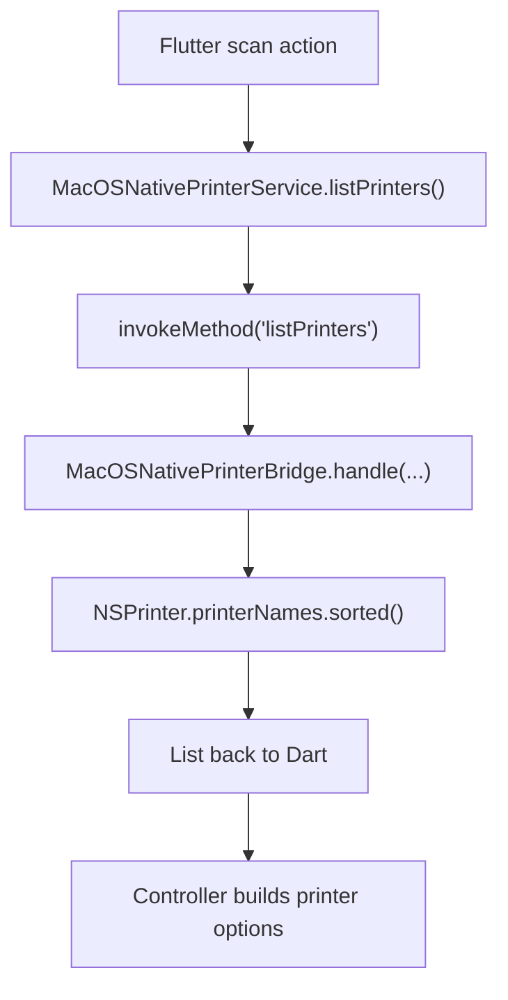
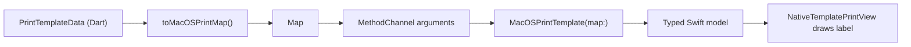

# Flutter Native Code Diagram

This diagram shows how native macOS code is injected into the Flutter app in this project.

Relevant files:

- [macos_native_printer_service.dart](/Users/thearith/project/business/r99/lib/src/core/printer/macos_native_printer_service.dart)
- [printer_page_controller_mixin.dart](/Users/thearith/project/business/r99/lib/src/controllers/printer_page_controller_mixin.dart)
- [MainFlutterWindow.swift](/Users/thearith/project/business/r99/macos/Runner/MainFlutterWindow.swift)
- [AppDelegate.swift](/Users/thearith/project/business/r99/macos/Runner/AppDelegate.swift)

## Injection Points

Native code enters this Flutter app in these locations:

- Flutter decision layer:
  [printer_page_controller_mixin.dart](/Users/thearith/project/business/r99/lib/src/controllers/printer_page_controller_mixin.dart)
- Dart platform bridge:
  [macos_native_printer_service.dart](/Users/thearith/project/business/r99/lib/src/core/printer/macos_native_printer_service.dart)
- macOS registration:
  [MainFlutterWindow.swift](/Users/thearith/project/business/r99/macos/Runner/MainFlutterWindow.swift)
- native Swift implementation:
  [AppDelegate.swift](/Users/thearith/project/business/r99/macos/Runner/AppDelegate.swift)

## High-Level Flow

## Registration Flow

When the macOS window starts, Flutter plugins are registered first, then the custom printer bridge is registered.

## Print Request Flow

This is the path used when the app prints through the native macOS printer queue.

## Printer List Flow

This is the path used when Flutter asks macOS for installed printer names.

## Data Model Flow

Flutter sends structured label data to Swift as a map. Swift turns it into a typed native model before printing.

## Why This Structure Helps

- Flutter stays responsible for app state and business flow.
- Swift stays responsible for macOS-only APIs.
- The `MethodChannel` is the boundary between cross-platform code and native code.
- The bridge is easier to debug because each layer has one clear role.

## Quick Mental Model

You can think of the system like this:

1. Flutter decides `what` to do.
2. The Dart service sends the request.
3. The Swift bridge decides `how` to do it on macOS.
4. Native AppKit printing performs the final OS-level work.
